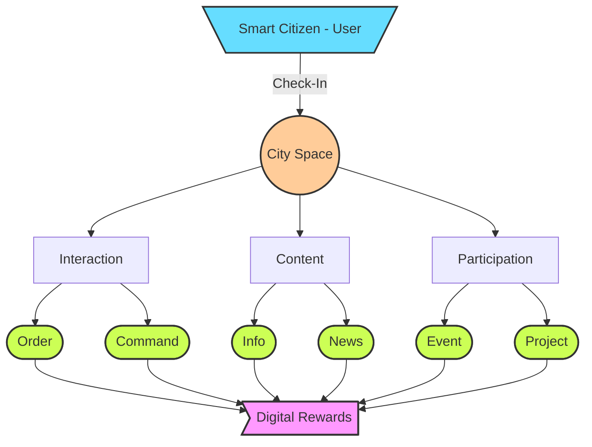

# City Spaces

----------------

## City Space interactions flow

```mermaid
graph TB;
    USER[\Smart Citizen - User/]-- Check-In -->SPACE((City Space));
    SPACE-->INTERACTION[Interaction];
    SPACE-->CONTENT[Content];
    SPACE-->PARTICIPATION[Participation];
    
    INTERACTION-->ORDER([Order]);
    INTERACTION-->COMMAND([Command]);
    CONTENT-->INFO([Info]);
    CONTENT-->NEWS([News]);
    PARTICIPATION-->EVENT([Event]);
    PARTICIPATION-->PROJECT([Project]);
    ORDER-->REWARD>Digital Rewards];
    COMMAND-->REWARD;
    INFO-->REWARD;
    NEWS-->REWARD;
    EVENT-->REWARD;
    PROJECT-->REWARD;
    style USER fill:#6df,stroke:#333,stroke-width:2px
    style SPACE fill:#fc9,stroke:#333,stroke-width:2px
    style ORDER fill:#CF5, stroke:#333,stroke-width:2px
    style COMMAND fill:#CF5, stroke:#333,stroke-width:2px
    style INFO fill:#CF5, stroke:#333,stroke-width:2px
    style NEWS fill:#CF5, stroke:#333,stroke-width:2px
    style EVENT fill:#CF5, stroke:#333,stroke-width:2px
    style PROJECT fill:#CF5, stroke:#333,stroke-width:2px
    style REWARD fill:#f9f,stroke:#333,stroke-width:2px
```