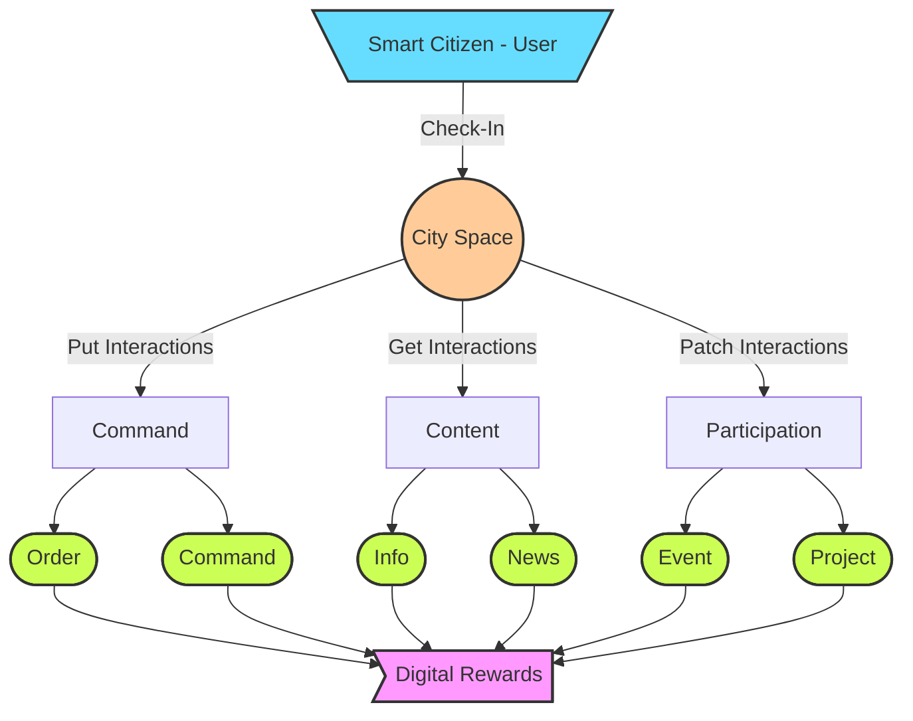

# Framework General Roadmap

----------------

- [ ] **The Base**

    _The basic framework for the CityOS ecosystem including the common elements for both layers, digital & virtual._

    - [ ] _User Management_
    - [ ] _Tokens Management_
    - [ ] _Organizations Management_
    - [ ] _City Spaces Management_
    - [ ] _Intelligent Agents Management_
    - [ ] _Teams Management_
    - [ ] _Context Management_
    - [ ] _Digital Rewards Framework_


- [ ] **The Prototypes** (PoCs) (v0.0.1)

    _A proof of concept approach is adopted for each main branch of features._

    The PoCs are organized around the City Spaces functionalities.


- [ ] **The MVP** (v0.1.0)

    _The minimum viable product for the CityOS ecosystem for each layer._


- [ ] **V1**
    
    _The first version of the CityOS ecosystem for each layer._


# Framework development flowchart

----------------




# F

----------------

```mermaid
graph TB;
    USER[\Smart Citizen - User/]-- Check-In -->SPACE((City Space));
    SPACE-- Put Interactions -->SEND[Send];
    SPACE-- Get Interactions -->RECEIVE[Receive];
    SPACE-- Patch Interactions -->PARTICIPATION[Participation];
    
    SEND-->ORDER([Order]);
    SEND-->EVENT([Event]);
    RECEIVE->EVENT;
    RECEIVE-->INFO([Info]);
    RECEIVE-->NEWS([News]);
    PARTICIPATION-->PROJECT([Project]);
    ORDER-->REWARD>Digital Rewards];
    COM-->REWARD;
    INFO-->REWARD;
    NEWS-->REWARD;
    EVENT-->REWARD;
    PROJECT-->REWARD;
    style USER fill:#6df,stroke:#333,stroke-width:2px
    style SPACE fill:#fc9,stroke:#333,stroke-width:2px
    style ORDER fill:#CF5, stroke:#333,stroke-width:2px
    style INFO fill:#CF5, stroke:#333,stroke-width:2px
    style NEWS fill:#CF5, stroke:#333,stroke-width:2px
    style EVENT fill:#CF5, stroke:#333,stroke-width:2px
    style PROJECT fill:#CF5, stroke:#333,stroke-width:2px
    style REWARD fill:#f9f,stroke:#333,stroke-width:2px   
```