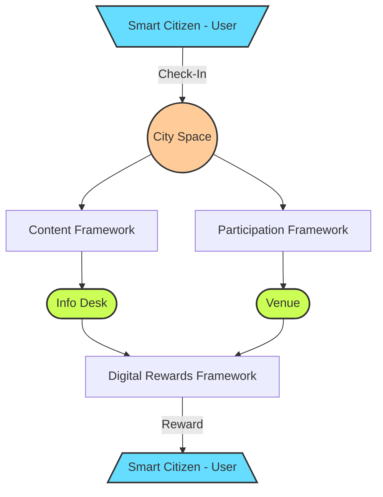

# General Roadmap

----------------

- [ ] **The Base**

    _The basic framework for the CityOS ecosystem including the common elements for both layers, digital & virtual._

    No particular order (yet).

    - [ ] _User Management_
    - [ ] _Tokens Management_
    - [ ] _Organizations Management_
    - [ ] _City Spaces Management_
      - [ ] _Check-in Interactions_
      - [ ] _Participation Framework_
      - [ ] _Content Framework_
      - [ ] _Command Framework_
    - [ ] _Digital Rewards Framework_
    - [ ] _Intelligent Agents Management_
    - [ ] _Teams Management_
    - [ ] _Project Management_
    - [ ] _Context Management_

- [ ] **The Prototypes** (PoCs) (v0.0.1)

    _A proof of concept approach is adopted for each main branch of features._
    
    No particular order (yet).

  - [ ] _Venue PoC_
    - [ ] _Idea Stream_ 
    - [ ] _Orders_
  - [ ] _Info Desk PoC_
    - [ ] _Orientation_
    - [ ] _Support_
    - [ ] _News_

- [ ] **The MVP** (v0.1.0)

    _The minimum viable product for the CityOS ecosystem for each layer._

  - [ ] _Digital City Layer_
  - [ ] _Virtual City Layer_

- [ ] **Beta Version** (V1.0.0)
    
    _The first version of the CityOS ecosystem for each layer._

# Ecosystem Flowchart

----------------

